# AURORATRADER

`AURORATRADER` is an AI-assisted crypto paper trading system built around Alpaca, MongoDB, a Node.js trading agent, and a React dashboard.

At a high level, the project:
- fetches crypto market data from Alpaca,
- evaluates trades with either rule-based strategies or an LLM,
- stores every decision in MongoDB,
- optionally auto-executes trades on an Alpaca paper account,
- exposes a dashboard to inspect trades, costs, settings, logs, strategies, backtests, and training data.

This repository is meant to be both:
- a working paper-trading bot you can run locally, and
- a sandbox for experimenting with LLM-driven trading workflows, cost controls, prompt design, and fine-tuning.

## What This Project Is

This project is:
- a **paper trading** system, not a live-money execution stack by default,
- a **research / experimentation repo** for strategy development,
- a **full stack app** with backend agent, API, frontend dashboard, and training assets,
- a hybrid system that supports both **deterministic rule-based strategies** and **LLM-based decision making**,
- a tool for collecting structured trade and market history that can later be reused for model training or analysis.

## What This Project Is Not

This project is not:
- a promise of profitability,
- financial advice,
- a high-frequency trading system,
- a latency-optimized execution engine,
- a guaranteed-safe autonomous trader,
- a substitute for proper risk controls, monitoring, or independent validation,
- production-grade infrastructure for real capital deployment without further hardening.

Important practical limitation:
- even when the agent is fully automated, the quality of the output is still constrained by your model choice, prompt, data freshness, strategy parameters, and Alpaca paper-trading behavior.

## Main Features

- **Multiple decision engines**
  - LLM strategy using Claude, OpenAI models, or Ollama.
  - Rule-based strategies such as momentum, mean reversion, breakout, trend following, and auto regime selection.

- **Manual or automatic execution**
  - Manual approval flow from the dashboard.
  - Auto-trade mode for paper execution.
  - Trade logging with approval and execution state.

- **Market and portfolio monitoring**
  - Alpaca market snapshot polling.
  - Separate intervals for decision cycles and Alpaca data refresh.
  - Portfolio, live prices, open positions, and risk status in the dashboard.

- **Risk controls**
  - Stop loss and take profit.
  - Trailing stop.
  - Confidence threshold filtering.
  - Kelly sizing.
  - Max open positions.
  - Drawdown-based circuit breaker.
  - Cost-aware trade filtering for LLM usage.

- **Observability**
  - MongoDB trade history.
  - Token usage and estimated API cost tracking.
  - Audit log.
  - Live logs and websocket-driven UI updates.

- **Research workflow**
  - Backtesting and strategy comparison.
  - Optimization tooling for rule-based strategies.
  - Dataset export from profitable historical trades.
  - Notebook and scripts for fine-tuning and local Ollama deployment.

## Themes
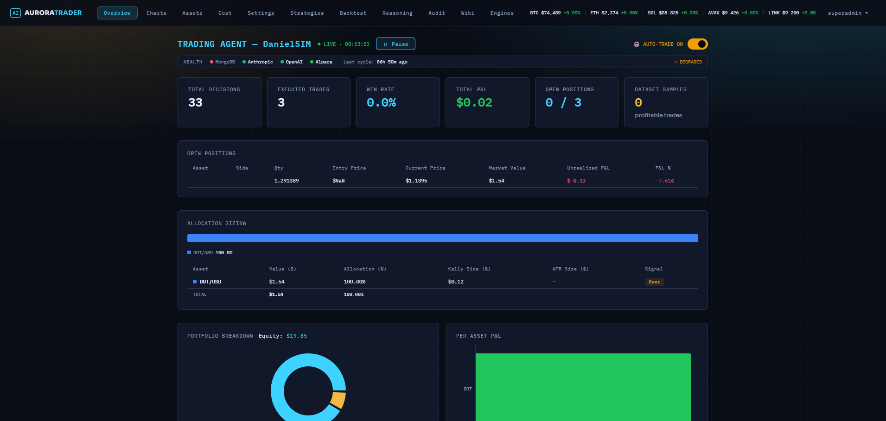
Dark
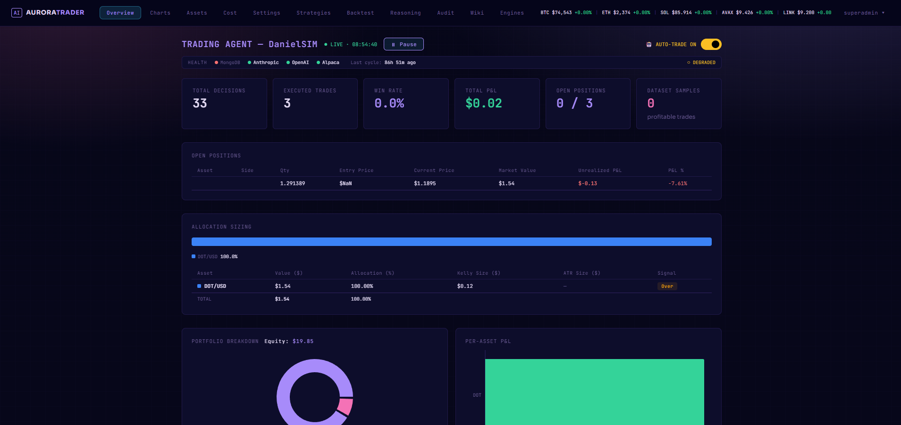
Midnight
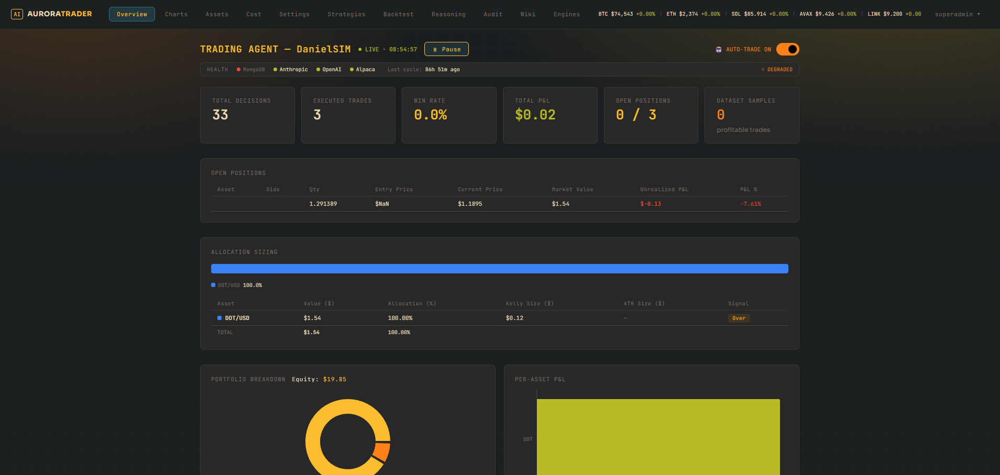
Gruvbox
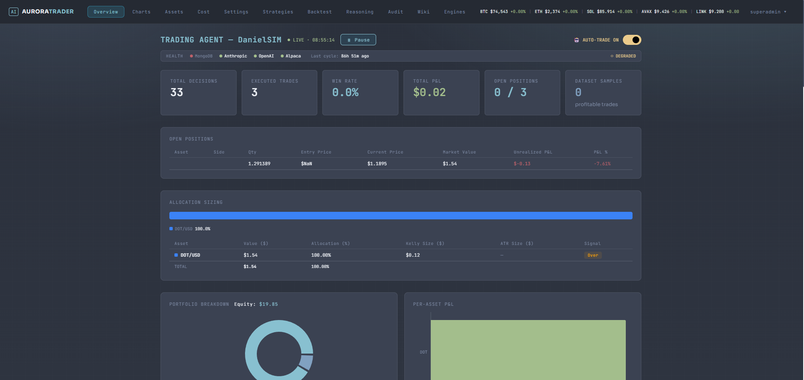
Nord
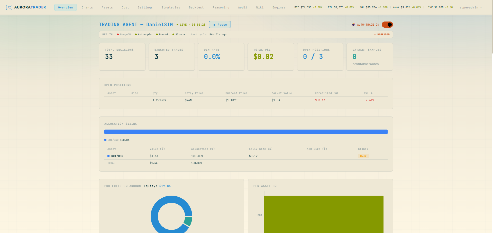
Solarized light
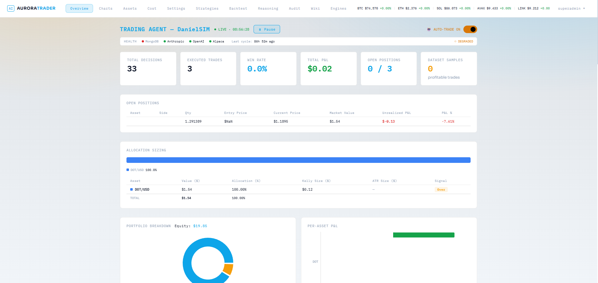
Light

## Screenshots

Overview
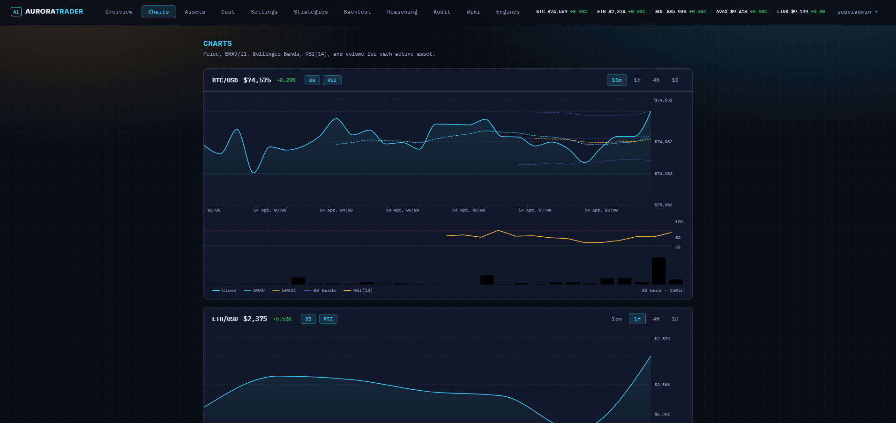
Charts
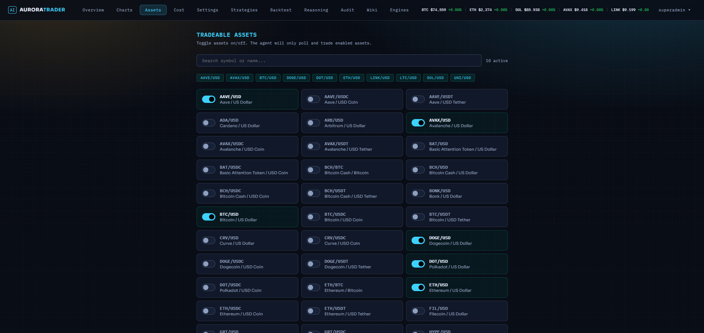
Assets
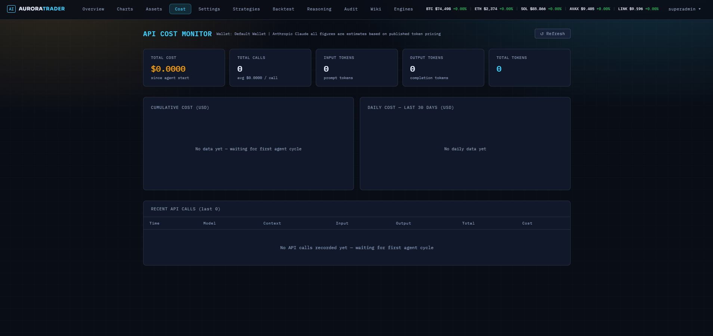
Api Cost Monitor
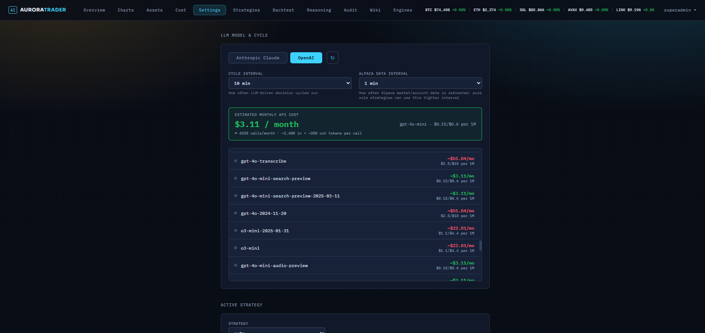
Settings
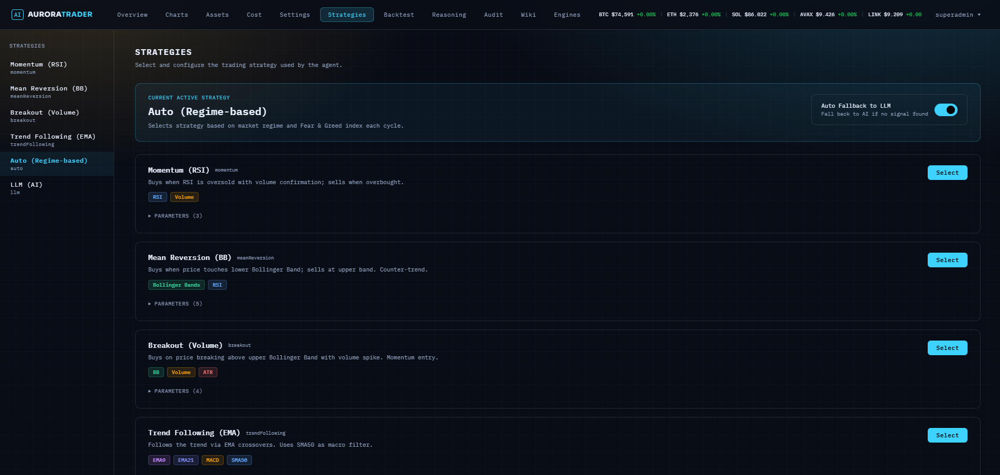
Strategies
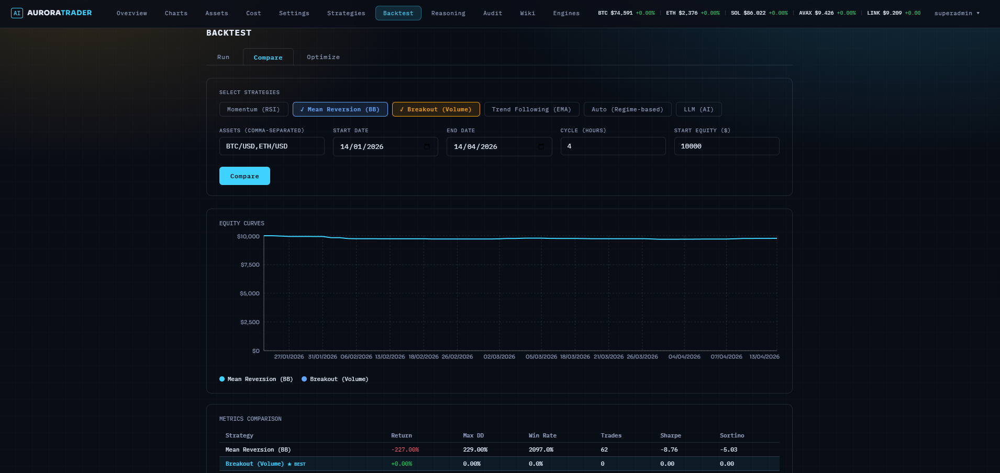
Backtest
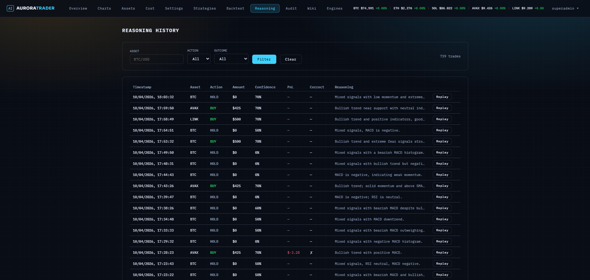
ReasoningHistory
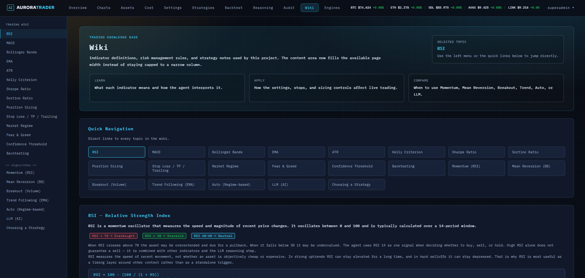
Wiki
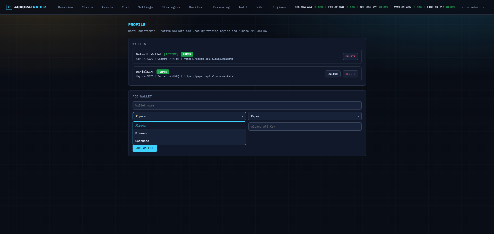
Profile

## Repository Structure

```text
.
|-- agent/             Node.js + TypeScript trading agent and API
|-- dashboard/         React + Vite dashboard
|-- training/          fine-tuning notebook and Ollama deployment assets
|-- docker-compose.yml container orchestration for the local stack
`-- README.md
```

## Stack

- **Agent**: Node.js + TypeScript
- **Dashboard**: React + TypeScript + Vite
- **Database**: MongoDB
- **Broker / market data**: Alpaca Paper API + Alpaca crypto data
- **LLM providers**: Anthropic, OpenAI, or Ollama
- **Training assets**: Colab / QLoRA-oriented notebook and Ollama deployment files

## How It Works

Typical flow:
1. The agent refreshes portfolio and market data from Alpaca.
2. It builds a market snapshot with indicators such as RSI, EMA, MACD, Bollinger Bands, ATR, and regime context.
3. A strategy evaluates the snapshot.
   - Rule-based strategies use deterministic logic.
   - The LLM strategy builds a prompt from market data, portfolio state, sentiment, and configuration.
4. The best decision is logged to MongoDB.
5. Depending on settings, the trade is either:
   - queued for manual approval, or
   - auto-executed on the Alpaca paper account.
6. The dashboard shows the result, logs, token cost, and later trade outcome.

## Quick Start

The easiest path is Docker Compose.

### 1. Configure environment

The root `docker-compose.yml` expects a root `.env` file.

Create `.env` in the repository root and add your secrets and runtime config.

Minimum useful values are typically:

```env
ANTHROPIC_API_KEY=...
OPENAI_API_KEY=...
ALPACA_API_KEY=...
ALPACA_API_SECRET=...
ALPACA_BASE_URL=https://paper-api.alpaca.markets
LLM_PROVIDER=claude
CLAUDE_MODEL=claude-haiku-4-5-20251001
POLL_INTERVAL_MINUTES=30
MARKET_DATA_INTERVAL_MINUTES=5
MONGO_URI=mongodb://mongo:27017/trading-agent
```

### 2. Start the stack

```bash
docker compose up -d
```

### 3. Open the app

- Dashboard: `http://localhost:3000`
- Agent API: `http://localhost:3001`

## Local Development

If you want to run services outside Docker:

### Agent

```bash
cd agent
npm install
npm run build
npm run dev
```

### Dashboard

```bash
cd dashboard
npm install
npm run build
npm run dev
```

The Vite dev server proxies `/api` and `/ws` to the agent on port `3001`.

## Configuration Highlights

The dashboard lets you configure:
- model and provider selection,
- decision cycle interval,
- Alpaca data refresh interval,
- stop loss, take profit, and trailing stop,
- confidence threshold,
- Kelly sizing,
- consensus mode,
- cost-aware LLM gating,
- active strategy and strategy parameters,
- manual approval vs auto-trade behavior.

## Training / Local Model Workflow

This repo also includes a path for replacing hosted APIs with a local model.

Typical workflow:
1. Run the paper trader long enough to collect useful history.
2. Export a dataset from the dashboard.
3. Use `training/finetune.ipynb` to fine-tune a local model.
4. Deploy that model through Ollama.
5. Point the agent to Ollama.

Example Ollama config:

```env
LLM_PROVIDER=ollama
OLLAMA_BASE_URL=http://your-server:11434
OLLAMA_MODEL=trading-llm
```

## Current Scope and Limitations

Before anyone clones this expecting a complete hedge-fund stack, the important boundaries are:

- **Paper trading first**
  - The repo is designed around Alpaca paper trading and experimentation.

- **Crypto only**
  - The current market data and execution assumptions are centered on Alpaca crypto symbols.

- **LLM outputs are probabilistic**
  - The LLM can produce inconsistent or low-quality trade reasoning if prompts, models, or surrounding controls are weak.

- **Backtests are useful, not definitive**
  - Historical results can overstate real-world performance.

- **Inference cost matters**
  - LLM strategies are slower and more expensive than rule-based strategies, which is why the repo includes token tracking and cost-aware controls.

- **Not hardened for unattended real-capital deployment**
  - If someone wanted to run this against live funds, they should expect to add stronger validation, monitoring, fail-safes, auth hardening, and operational controls.

## Why Someone Might Find This Repo Interesting

This repo is useful if you want to study or build:
- an end-to-end AI trading prototype,
- a hybrid rule-based + LLM trading architecture,
- a dashboard-driven agent with auditability,
- an LLM cost-aware decision system,
- a paper-trading data collection pipeline for future fine-tuning,
- a practical example of using MongoDB + Node + React for an autonomous agent workflow.

## API Snapshot

Some useful endpoints:

| Endpoint | Purpose |
|---|---|
| `GET /api/stats` | summary metrics |
| `GET /api/trades` | decision history |
| `GET /api/trades/pending` | manual approvals queue |
| `POST /api/trades/:id/approve` | approve and execute a pending trade |
| `POST /api/trades/:id/reject` | reject a pending trade |
| `GET /api/config` | current runtime config |
| `POST /api/config/risk` | update strategy, risk, and cycle settings |
| `GET /api/tokens/stats` | token and cost usage |
| `POST /api/dataset/export` | export training dataset |

## Notes For Visitors

If someone opens this repo on GitHub, the important thing to understand is that this is not just "an LLM prompt calling Alpaca".

It is a full workflow project with:
- an agent,
- a dashboard,
- persistence,
- strategy selection,
- approval flow,
- risk controls,
- cost tracking,
- backtesting,
- and a path toward fine-tuning or local inference.

That is the main point of the repository.
